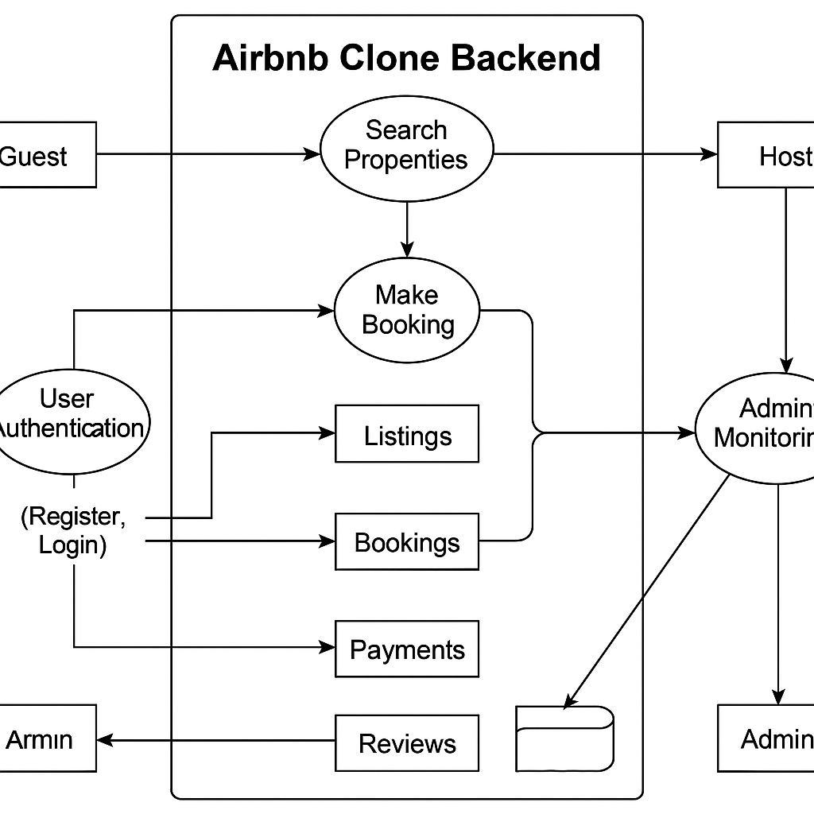

# Data flow diagram

## Walkthrough of the Diagram Components
### External Entities
👤 Guest – Can register, search listings, book properties, make payments, and leave reviews.

🏘️ Host – Can list, update, or delete properties and view bookings.

🛡️ Admin – Oversees the system, monitors data activity, and manages users and listings.

### Processes
#### Process	Description
User Authentication: 	Handles sign up, login, and user identity verification

Manage Listings: 	Allows hosts to create, update, or delete property listings
Search Properties: 	Processes guest search queries based on filters like location or price
Make Booking: 	Enables guests to reserve available listings
Process Payment:	Manages payment transactions between guests and hosts (via Stripe/PayPal)
Leave Review:	Lets guests submit feedback about their stay
Admin Monitoring: 	Allows administrators to audit bookings, users, and transactions

### Data Stores
#### Data Store	  and What It Holds
Users DB: 	Account credentials, roles (guest, host, admin), and profile info
Listings DB:	Property details like title, description, price, location, and availability
Bookings DB:	Reservation records including user, property, and date range
Payments DB:	Transaction metadata, billing info, and payout statuses
Reviews DB:	Guest-submitted reviews linked to properties and bookings